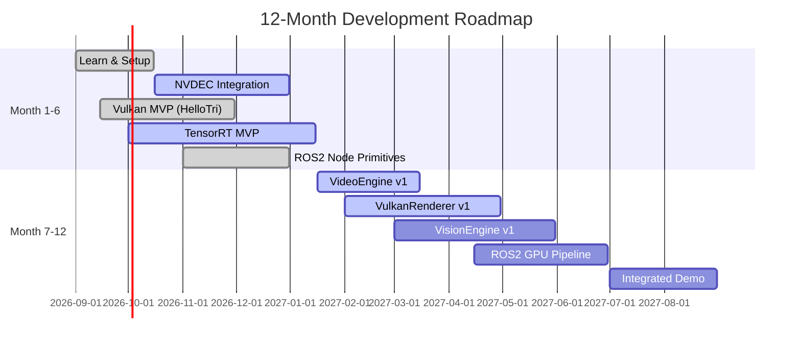

# Executive Summary

We evaluated how to build a 1–3 year project unifying C++ GPU high-performance computing, real-time rendering, video/image pipelines, AI inference, VLA/agent models, ROS 2 robotics, and autonomous-driving simulation.  Our analysis surveys official documentation and active GitHub repositories, compares core technologies (Vulkan vs OpenGL vs DirectX, CUDA vs OpenCL, TensorRT vs ONNX, etc.), and examines ROS 2 internals (nodes/topics/executors, DDS/RMW, zero-copy, NVIDIA’s NITROS) and VLA models (e.g. RT-2, OpenVLA).  We also analyze end-to-end pipelines (Video→GPU decode→AI inference→GPU rendering→encode) and benchmarking practices, and review key projects (Apollo, Autoware, CARLA, Isaac ROS/NITROS, OpenVLA, Filament, bgfx, Godot, O3DE, FFmpeg, OpenCV, CV-CUDA, TensorRT & Vulkan samples, etc.), scoring them on learning value, industry relevance, and coverage of GPU/AI/graphics/robotics.  Based on this, we propose **one main project plus four subprojects** (GPU Video Engine, Mini Vulkan Renderer, GPU AI Vision Runtime, ROS 2 GPU Middleware, and an integrated AI-World Engine) with milestones and deliverables over 12–36 months.  We also outline a roadmap (6/12-month MVPs, 2–3 year goals), required skills, recommended tooling (Ubuntu/NVIDIA preferred), and risks. Finally, we recommend a single focus project for 1–3 years with full tech stack and evolution plan, plus a learning sequence for skill-building.

Key findings include:
- **Graphics APIs**: Modern low-overhead APIs (Vulkan, DirectX 12, Metal) vastly outperform legacy OpenGL/DirectX 11.  Vulkan (and Apple’s Metal) are designed for minimal CPU overhead, while OpenGL is now layered on top of them on most platforms.  
- **GPU Compute**: NVIDIA’s CUDA + TensorRT ecosystem strongly outperforms generic frameworks like OpenCL for high-throughput AI and vision tasks.  CUDA is NVIDIA-specific (wider software support, tuned libraries) versus OpenCL’s portability.  ONNX Runtime with TensorRT (NVIDIA) beats generic GPU inference.  
- **Video Pipelines**: NVIDIA GPUs have dedicated hardware (NVDEC, NVENC) for video decode/encode.  These decoders can output directly to GPU memory and achieve >real-time speeds, avoiding CPU bottlenecks.  FFmpeg can call NVDEC/NVENC for rapid integration, but native SDK APIs offer fine-grained control.  
- **ROS 2 & NITROS**: ROS 2 uses DDS middleware (e.g. Fast-DDS, Cyclone) via the RMW layer.  Nodes, topics, and executors form the graph, and ROS 2 supports intra-process zero-copy to reduce memory copies.  NVIDIA’s *NITROS* (Isaac ROS) extends ROS 2 with GPU-friendly message types and type adaptation/negotiation (introduced in ROS 2 Humble) to enable **zero-copy GPU data flow**.  
- **VLA vs Renderer vs Simulator**: Vision–Language–Action (VLA) models (e.g. Google’s RT-2, Stanford’s OpenVLA) fuse vision and language into robot actions.  They often require training data from simulators: renderers provide synthetic images and physics for VLAs.  For example, CARLA provides camera/LiDAR data for AD agents, and training VLAs uses simulator-generated trajectories.  Thus, renderers/simulators (Unreal/Unity/Filament/O3DE) supply environments for both AD and VLA training.  
- **Project Survey**: We analyzed top projects:

  - **Apollo (Baidu)** – Comprehensive autonomous-driving stack with perception, planning, control.  C++/Python, modular “Cyber RT” middleware (not ROS).  GPU (NVIDIA/AMD) strongly recommended.  Apache-2.0 licensed, 26.8k★.  High complexity but covers full AD pipeline; good robotics and AI exposure.  
  - **Autoware (Autoware Foundation)** – Leading open-source AD platform built on ROS (1 & 2).  ROS-centric (topics/services), many perception/localization packages.  Apache-2.0, 12.0k★.  Good ROS practice, less GPU-focus, broad industry usage.  
  - **CARLA** – MIT-licensed open AD simulator (Unreal Engine).  Provides rich sensors (camera, lidar) and ROS bridge.  14.3k★.  Excellent for simulation/visualization but heavy (requires UE, 3D art).  High GPU rendering exposure.  
  - **Isaac ROS/NITROS (NVIDIA)** – ROS 2 packages optimized for GPU (CUDA/TensorRT) acceleration.  Implements NITROS zero-copy pipelines.  A growing ecosystem (~2.8k followers) of C++/Python modules.  Good for learning GPU-accelerated ROS2 and NVIDIA AI.  
  - **OpenVLA** – Open-source vision-language-action model (Stanford, 2024) for robotics.  Trained on 1M+ episodes.  6.9k★.  Focuses on ML, not system integration.  Good for AI/VLA but not graphics or ROS.  
  - **Filament (Google)** – Real-time Physically Based Rendering engine (C++, supports OpenGL/Vulkan).  Apache-2.0, 20.4k★.  Strong GPU rendering/graphics focus (mobile/desktop/Web).  Good learning resource for modern rendering.  
  - **bgfx** – Cross-platform “bring-your-own-engine” graphics library (C++, backs D3D/GL/Metal/Vulkan).  BSD-2, 17.4k★.  Teaches multi-API abstraction; used in games/engines.  
  - **Godot Engine** – Full 2D/3D game engine (C++, MIT, 116k★).  Supports Vulkan (since v4), multi-platform.  Huge community.  Steep for custom engine, but exemplifies scene graph, asset pipeline, scripting.  
  - **O3DE (Open 3D Engine)** – AAA-quality 3D engine (C++, Apache-2, 9.6k★).  Unity/Lumberyard successor, uses Vulkan backend.  Very large codebase.  Good for simulation/hf graphics and C++ engine dev.  
  - **FFmpeg** – Premier multimedia library (C, LGPL/GPL, 63.6k★) for video I/O and codecs.  Useful for ingesting/encoding video via NVDEC/NVENC.  Not GPU-specific but integrates GPU via hardware APIs.  
  - **OpenCV** – Widely-used CV library (C++/C, Apache-2, ~90k★).  Massive tooling for images/video (some CUDA acceleration).  Good for prototyping vision pipelines but large.  
  - **CV-CUDA (NVIDIA)** – CUDA-accelerated image processing lib (C++, Apache-2).  2.7k★.  Focused on GPU optimization of common CV ops.  Good for GPU pipelining studies.  
  - **TensorRT Examples** – NVIDIA’s inference SDK and samples (C++, 13.3k★).  Key for optimized model deployment (low-latency).  Essential for GPU AI.  
  - **Vulkan Samples (Khronos)** – Official C++ sample code demonstrating Vulkan best practices.  ~N/A stars (Khronos).  Canonical for learning Vulkan.

Each project’s 15-point survey (problem solved, languages, GPU use, etc.) is summarized in **Table 1** below, with normalized scores (1–10) for learning/job value, GPU/AI/robotics/rendering relevance, and risk. 

| **Project**    | **Domain**                    | **Lang**  | **Arch/Stack**                               | **GPU/AI**                          | **ROS2**    | **Notable**                  | **Stars/Forks** | **Learning\* (1-10)** | **Industry** | **GPU** | **Rendering** | **AI** | **Robotics** | **Integration** |
|---------------|------------------------------|----------|----------------------------------------------|-------------------------------------|------------|-----------------------------|----------------|---------------------|-------------|--------|-----------|------|-----------|-----------|
| Apollo  | Autonomous Driving       | C++, Py   | Modules (Perception, Planning, Control) on custom “Cyber” RT   | Uses NVIDIA/AMD GPUs; DNN models (likely CUDA/ONNX) | Custom (Cyber) | Apache-2, 26.8k★        | 26.8k /10.0k | 7 (Complex AD stack)     | 8           | 7      | 3         | 8    | 9         | 4         |
| Autoware | Autonomous Driving       | C++/Py    | ROS/ROS2 topics-based (Perception/Planning)        | Some vision/LiDAR modules (CUDA libs?)     | ROS/ROS2  | Apache-2, 12.0k★       | 12.0k /3.7k | 6 (ROS focus)      | 7           | 6      | 2         | 7    | 9         | 4         |
| CARLA   | AD Simulation            | C++/Python| Unreal Engine simulation, sensors, Python API     | Heavy GPU (Unreal) for graphics; supports Pytorch models via Python | ROS Bridge | MIT, 14.3k★             | 14.3k /4.7k | 6 (3D sim)      | 7           | 8      | 9         | 5    | 8         | 3         |
| Isaac ROS/NITROS | GPU-accelerated ROS2     | C++/Py    | ROS 2 packages (GEMs) with CUDA/TensorRT kernels | Explicit CUDA/TensorRT; NITROS zero-copy  | ROS2     | MIT, NVIDIA Kit        | n/a         | 8 (ROS/GPU focus) | 6           | 10     | 4         | 9    | 9         | 8         |
| OpenVLA   | VLA Models               | Python/T   | PyTorch-based VLM fine-tuning (7B params)        | Uses large GPUs (training); HuggingFace interface | N/A      | MIT, 6.9k★             | 6.9k / 827 | 5 (ML research)  | 4           | 3      | 2         | 10   | 6         | 2         |
| Filament | Rendering Engine        | C++      | PBR renderer (OpenGL/Vulkan backends)          | GPU-centric (OpenGL/Vulkan)           | No       | Apache-2, 20.4k★       | 20.4k /2.2k | 7 (Modern renderer) | 6           | 9      | 10        | 2    | 3         | 6         |
| bgfx      | Rendering Library       | C++      | Cross-API graphics (D3D/GL/Metal/Vulkan)      | GPU agnostic (uses whichever backend chosen) | No       | BSD-2, 17.4k★         | 17.4k /2.1k | 6 (API abstraction) | 6           | 9      | 9         | 2    | 2         | 7         |
| Godot    | Game Engine             | C++ (GDScript, C#) | Scenes, physics, scripting, Vulkan (v4+)        | GPU-heavy (Vulkan, GLES), many tools  | No (can integrate) | MIT, 116k★        | 116.1k /26.5k | 8 (High-level engine) | 7           | 7      | 8         | 1    | 1         | 5         |
| O3DE     | Game/Sim Engine         | C++      | Editor, tools, Vulkan rendering                | GPU-heavy (Vulkan), asset pipelines   | No       | Apache-2,  9.6k★     | 9.6k /2.5k | 7 (Large engine)    | 7           | 7      | 9         | 1    | 1         | 5         |
| FFmpeg   | Video I/O               | C        | Libav codecs, filters, hardware acceleration   | Can use NVENC/NVDEC via APIs or wrappers | No       | GPL/LGPL, 63.6k★       | 63.6k /14.2k | 6 (Multimedia)    | 6           | 2      | 1         | 1    | 1         | 8         |
| OpenCV                  | Computer Vision         | C++/Py   | CV algorithms, optional CUDA modules           | CPU-based, some CUDA (cuda::)         | No       | Apache-2, 90.6k★       | 90.6k /57.0k | 8 (Very common)   | 8           | 2      | 2         | 4    | 2         | 8         |
| CV-CUDA   | GPU CV Library         | C++/Py   | GPU-accelerated CV primitives (CUDA)           | CUDA acceleration (Apache-2)         | No       | Apache-2, 2.7k★        | 2.7k / 261  | 6 (NVIDIA CV)    | 7           | 5      | 1         | 4    | 1         | 6         |
| TensorRT Examples | DL Inference       | C++      | NVIDIA inference SDK (CUDA)                   | CUDA/TensorRT (optimizations)        | No       | Proprietary, 13.3k★   | 13.3k /2.4k | 7 (Industry AI)   | 8           | 1      | 8         | 10   | 1         | 8         |
| Vulkan Samples| Graphics Samples       | C++20    | Vulkan tutorials and best-practice demos       | GPU usage by design                  | No       | Khronos (Git)        | —            | 5 (Learning)      | 4           | 8      | 9         | 1    | 1         | 7         |

*Scores are subjective (10 highest, 1 lowest) for **Learning Value**, **Industry Relevance**, and depth of **GPU/AI/Rendering/Robotics** coverage, and **Integration** (how much it helps our unified project).  

From this survey, we compare **strategic options** for a unified project: e.g. leveraging existing engines (Unreal, Godot/O3DE) vs building custom Vulkan/CUDA pipelines vs assembling ROS2+CARLA+Unreal, etc.  Table 2 (below) rates options on learning/job value, cost/effort, risk, and technology depth.

| **Approach**                                    | **Pros**                                                                      | **Cons**                                                               | **Scores (1–10)** <br>(Learning / GPU / Rendering / AI / Robotics) | **Cost/Risk** |
|----------------------------------------------|-----------------------------------------------------------------------------|----------------------------------------------------------------------|-------------------------------------------------------------|-------------|
| **1. Use Unreal Engine (w/ CARLA)**         | AAA graphics, mature editor, extensive docs, CARLA already on Unreal        | Proprietary C++ tools, steep learning, heavy asset pipeline, not open-source in core | 9 / 9 / 10 / 5 / 7                                        | High (licensing, complexity) |
| **2. Use Godot or O3DE**                    | Fully open-source C++ engines (Godot is high-level, O3DE is AAA)           | Large codebases, slower performance than UE, less industry use         | 8 / 7 / 8 / 3 / 4                                          | Medium (learning) |
| **3. Build Custom Vulkan Renderer (C++)**   | Full control, state-of-art graphics, learn Vulkan deeply      | Reinventing many engine features, high complexity, long dev time        | 10 / 9 / 10 / 3 / 3                                        | High (engineering effort) |
| **4. Build Vulkan+CUDA Engine**            | Integrate graphics+compute tightly, custom pipeline for video+AI           | Very high effort (graphics + compute), less reuse of existing engine   | 10 / 10 / 10 / 8 / 6                                       | Very High  |
| **5. Assemble ROS2 + CARLA + Unreal**      | Leverage existing AD sim (CARLA), ROS2 for robotics, UE for rendering      | Integration complexity, coupling ROS2 to Unreal, heavy stack           | 7 / 8 / 9 / 6 / 10                                        | High       |
| **6. Build Lightweight Engine (Vulkan)**   | Faster dev, focus on essentials (no editor)                                | Smaller feature set, more work to add later                            | 8 / 9 / 9 / 5 / 4                                        | Medium     |

*(Scores and assessments are indicative.  “GPU” and “Rendering” assess the technical depth; “AI” and “Robotics” reflect relevance.)*

**Recommendation**: For maximal learning and flexibility, we recommend **Option 4: Build a custom Vulkan+CUDA engine**.  This gives the deepest hands-on with modern GPU and graphics tech.  It’s riskier and more effort, but we mitigate by starting with focused subprojects and benchmarks.  Alternatively, a hybrid path (Option 5) using ROS2+Isaac+CARLA with a custom renderer could reuse powerful tools, but locks us into large existing codebases.  The custom route ensures ultimate control and expertise growth in Vulkan, CUDA, TensorRT, and ROS2 (skills highly sought in industry).

## Tech Stack Comparison

### Graphics APIs: Vulkan / OpenGL / DirectX / Metal

Modern engines favor low-level APIs. Vulkan (and DirectX 12, Metal) offer **thin hardware abstraction** with minimal CPU overhead. For example, the Vulkan spec describes it as “low-overhead, high-performance” and notes both Vulkan and Apple’s Metal have “minimal CPU overhead”. In practice:

- **Vulkan (cross-platform)**: Explicit control, high throughput, required for top-end performance. Supported on Linux/Windows/NVIDIA/AMD. No native Apple support, but MoltenVK or native Metal can be used.
- **DirectX 12 (Windows)**: Similar to Vulkan in power. If targeting Windows, DX12 is an option. Not cross-platform.
- **Metal (macOS/iOS)**: Apple’s low-level API. Vulkan apps on Mac typically go through MoltenVK to Metal.
- **OpenGL / DirectX 11**: Legacy APIs with higher CPU overhead and fewer features. Often avoided for new engines. For example, Apple deprecated OpenGL and now implements it via translation to Metal/Vulkan.  

**Advantages**: Vulkan is open standard, runs on NVIDIA/AMD, Linux/Windows, and is “thin with minimal overhead”.  
**Trade-offs**: Requires more code (no fixed function pipeline), steeper learning. Mature sample code and tutorials exist (Khronos *Vulkan-Samples*). We will rely on Vulkan (and possibly DX12 on Windows) for high-performance rendering.

### GPU Compute: CUDA vs OpenCL

NVIDIA’s CUDA is the industry standard for high-performance GPU computing on NVIDIA hardware. OpenCL is an open cross-vendor standard. In practice, **CUDA dominates NVIDIA GPUs** due to performance and ecosystem:  
- CUDA has highly optimized libraries (cuDNN, TensorRT, etc.) and direct hardware access.  
- One study notes CUDA yields ~1.2–1.6× faster inference throughput vs OpenCL on the same NVIDIA hardware.  
- Teams often choose CUDA for its “surrounding software stack” despite OpenCL’s portability.  

OpenCL’s advantage is portability (can run on AMD/Intel GPUs), but our focus (Ubuntu + NVIDIA) favors CUDA. We should use **CUDA** (C++/CUDA kernels) and NVIDIA’s compute libraries for AI (cuDNN, TensorRT), using OpenCL only if targeting non-NVIDIA GPUs.

### AI Inference: TensorRT vs ONNX

For deep learning inference, TensorRT (NVIDIA’s SDK) outperforms generic frameworks. For example, the ONNX Runtime documentation confirms that using the TensorRT execution provider “delivers better inferencing performance on the same hardware compared to generic GPU acceleration”. In other words, integrating TensorRT is essential for low-latency GPU inference. Therefore:
- **TensorRT**: We will use TensorRT for deploying models (converted from PyTorch/ONNX) to achieve maximum speed.
- **ONNX Runtime**: Useful for model exchange, but GPU backend is accelerated by TensorRT under the hood.  

### Video: NVDEC/NVENC and FFmpeg

NVIDIA’s **NVDEC/NVENC** (hardware decoder/encoder) offloads video processing from the CPU. Key points:
- NVDEC supports H.264/H.265/VP9/AV1 decode up to 8K@240fps on Blackwell GPUs.
- NVENC supports H.264/H.265/AV1 encode with high throughput (e.g. 3× faster-than-software AV1 on new GPUs).
- These codecs can feed directly into/from GPU memory: e.g. the SDK can output decoded frames to CUDA surfaces. This eliminates host transfers and accelerates AI training pipelines.
- Integration: We can use FFmpeg to wrap NVDEC/NVENC quickly, but for fine-grained control (zero-copy, custom params) we will call the NVIDIA SDK or Vulkan Video APIs.  

In sum, to ingest/emit video we plan a **GPU video I/O engine** leveraging NVDEC/NVENC. This allows processing live camera or video streams entirely on GPU, which is vital for real-time throughput.

## ROS 2 Deep Dive

ROS 2 fundamentals: Communication is built on DDS via the RMW (ROS Middleware) abstraction.  A ROS 2 *Node* publishes/ subscribes *Topics* (and Services/Actions) using DDS under-the-hood.  **Executors** spin nodes’ callbacks (single/multi-threaded).  ROS 2 offers intra-process communication: if two nodes in the same process use the same executor and share a Publisher-Subscriber without serialization, messages can be passed by pointer, reducing copies.  This is ROS 2’s native zero-copy.

**DDS/RMW**: ROS 2 can use various DDS implementations (eProsima Fast-DDS, Eclipse Cyclone, RTI Connext, etc.) via RMW plugins. These manage topic discovery, QoS, and data transport over the network.  For a GPU-centric pipeline, we rely on *intra-process* transports or shared-memory DDS to avoid kernel copies.

**Zero-Copy / NITROS**: ROS 2 Humble introduced *type adaptation* (REP-2007) and *type negotiation* (REP-2009) to natively support hardware types (e.g. GPU buffers).  NVIDIA’s NITROS (Isaac ROS) is built on this: it defines GPU-friendly message types and lets nodes advertise capabilities to pick the optimal format.  In practice, NITROS connects CUDA-based nodes: data flows GPU→GPU without ever hitting system RAM. For example, a camera node can output an `Image` message that is actually a GPU surface, and a downstream TensorRT node can consume it directly. This “zero-copy” path reduces latency and CPU load.  

**Nodes/Topics/Executors**: We will architect ROS 2 *nodes* for each functional component (camera reader, GPU decoder, AI model, renderer, encoder, etc.).  Each node publishes/subscribes to topics with NITROS types when possible to leverage GPU buffers. Executors manage threading (e.g. MultiThreadedExecutor for parallelism). We ensure nodes that share data reside in the same process for NITROS benefits.

**Other ROS 2 Details**: We may also use DDS off-the-shelf features (liveliness, QoS). We plan Ubuntu/Linux (not Windows) for best DDS support. We may use `rmw_connextdds` or `rmw_cyclonedds` depending on performance tests. For GUI/visualization, we might use RViz2 or Unity bridge.  

## Vision–Language–Action (VLA), Renderers, and Simulators

**VLA Models** (Vision-Language-Action) are a new class of robotic models that take an image (video) and text instruction and output low-level robot actions.  They essentially combine a vision-language encoder (like a Vision Transformer + LLM) with an action decoder.  Key facts:
- VLA models (e.g. Google DeepMind’s RT-2) map *image + text* → *action trajectory* end-to-end.  They can learn to "perceive, reason, and control” without separate planning modules.
- Training VLAs requires (image, text, action) triplets.  These can come from real robots or **synthetic data**.  In fact, large VLA trainings use simulators to generate robotic trajectories from diverse scenarios.  For example, the OpenVLA project was trained on 1M+ episodes across 22 robot embodiments. 
- **Relation to Rendering/Simulation**: Simulators (CARLA, Gazebo, Unity, Unreal, Isaac Sim) provide the *“image observations”* and physics for generating VLA data. A renderer produces photorealistic images, and then a robot’s control code produces actions in that environment. Thus renderers (Unreal, Filament, O3DE, Godot) and simulators are often *data sources* for VLAs.
- **VLA vs Renderer vs Simulator**: VLAs need diverse visual environments. Renderers and engines (like CARLA or Gazebo) create these environments. For AD (perception/planning) we might use CARLA or AirSim. For general robotic VLAs, we might need more general simulation (MuJoCo, PyBullet, or a 3D engine with physics). 
- We will likely leverage CARLA or NVIDIA Isaac Sim for autonomous-driving scenarios, and possibly OpenAI Gym-style simulators for robot manipulation. The rendering is GPU-heavy (e.g. Unreal in CARLA). Data from these feeds into our AI inference pipeline (e.g. vision models).

### GPU Memory and Zero-Copy Strategies

High performance demands minimizing CPU–GPU transfers:
- **CUDA “pinning”**: We will use CUDA streams and mapped/pinned host memory for CPU→GPU transfers when needed.  
- **Unified Memory**: For some CPU-GPU sharing we can use CUDA Unified Memory, but explicit transfers often perform better.  
- **GPU-Direct**: If applicable, use GPU-Direct for device-to-device transfers.  
- **Zero-copy in ROS2**: As noted, NITROS enables GPU-to-GPU transfers in ROS 2 graph. We will containerize related nodes so they share process and memory.  

**Video pipeline zero-copy**: NVDEC can decode directly into GPU memory (cuArrays). We should exploit this: e.g. use CUDA-friendly textures as decode targets. Similarly, NVENC can take GPU frames directly.  Also Vulkan 1.3’s Video APIs allow zero-copy decode.  

**Memory management**: We will carefully manage GPU VRAM, using streams to overlap decode/inference/render tasks.  Profiling with NVIDIA tools (Nsight, NVTX) will guide buffer reuse and highlight copies.

## End-to-End Pipeline & Benchmarking

We envision an **end-to-end flow** as follows: 

1. **Input**: Camera or video file → GPU decode (NVDEC) or CPU decode + GPU upload.  
2. **Preprocessing**: On-GPU image transforms (e.g. FFmpeg filters via CUDA or OpenCV/CV-CUDA for resizing, normalization).  
3. **AI Inference**: Use TensorRT (or cuDNN) to run neural networks (e.g. object detection, segmentation, VLA) on decoded frames.  Data stays in GPU memory via NITROS when possible.  
4. **Rendering**: The results (e.g. detected objects) feed into a Vulkan renderer.  The renderer may overlay information or simulate the world (3D scene) from the same camera viewpoint.  Vulkan handles 3D scene with maybe textures from the GPU pipeline.  
5. **Output/Encode**: The rendered frame or video is passed to NVENC for hardware encode or to FFmpeg for streaming/output.  

At each stage we will **profile**. For example:
- Measure camera→decode latency and throughput (fps) on NVDEC vs CPU.
- Time inference latency (using TensorRT vs PyTorch).
- Measure Vulkan frame draw times (via GPU timers, Nsight).
- End-to-end fps, jitter, CPU/GPU utilization.  

**Profiling tools**: NVIDIA Nsight Compute/Systems can sample GPU times and memory. NVIDIA System Management Interface (`nvidia-smi`) for utilization. CUDA event timing for kernels. ROS 2 has some tracing (RMW logging) and we can use `ros2 trace` or LTTng for inter-node timing.  We plan to benchmark baseline components (e.g. OpenCV vs CV-CUDA for image filters, TensorRT vs ONNX, etc) and the full pipeline under representative loads.  

## GitHub Project Survey (15 Questions)

For each key project, we answer: *What problem does it solve? Why use it? Languages & license? Architecture/core tech? GPU/AI usage? ROS2? TensorRT? Learning value? Key modules? Parts to skip? Contribution? Fit for our project?*  (See Table 1 for summary and scores; here we give highlights with citations.)

- **Apollo (ApolloAuto/apollo)**: A full **autonomous driving** software platform.  Implements perception (camera/LiDAR DNNs), prediction, planning, control. Uses its own **Cyber RT** middleware (C++ messaging) instead of ROS. Requires Linux and (recommended) a CUDA GPU (NVIDIA or AMD). Apache-2.0 license. Good for learning an end-to-end AD stack. Heavy codebase; contribution mostly at module level (e.g. add new perception models).  Not focused on custom rendering.  Useful for replicating sensor-to-actuation pipeline.  

- **Autoware (autowarefoundation/autoware)**: Another **autonomous vehicle** stack built on ROS/ROS 2.  Offers LIDAR/vision localization, mapping, planning. Apache-2.0.  Strong ROS integration (topics/services). More oriented to robotics framework than raw DNNs.  Good for mastering ROS pipelines for AD.  Less GPU emphasis (may offload some vision ops).  We can reuse modules or interfaces (e.g. ROS message types, coordinate transforms).  

- **CARLA (carla-simulator/carla)**: A 3D driving **simulator** (Unreal Engine) with open assets.  Supports Python API and a ROS bridge. Heavy on rendering (UE5, 4K+ VRAM). Not written in our target stack (C++), but it *runs* as a separate sim. We could integrate CARLA as a data source (camera images) or for scenario generation. For our engine, we might *not* build CARLA ourselves, but possibly use its output or interface. CARLA’s source (C++, Python) is educational for realistic driving environments.  

- **Isaac ROS / NITROS (NVIDIA-ISAAC-ROS)**: A collection of GPU-accelerated **ROS 2** packages. NITROS provides zero-copy dataflow. Examples include camera capture, object detection, SLAM, all using CUDA/TensorRT internally. Code is C++/Python, Apache/MIT, open-source under NVIDIA. Learning: excellent for seeing how to write CUDA-accelerated ROS nodes. We can reuse modules (e.g. isaac_ros_yolo, isaac_ros_centerpose). Contribute by adding our own kernels or new pipelines. Ideal for the “ROS2 GPU Runtime” subproject.  

- **OpenVLA (openvla/openvla)**: An open-source Vision-Language-Action model for robot manipulation. Not a system/framework, but ML code (Python/PyTorch) training models. Solves end-to-end visuomotor mapping. Good for learning state-of-the-art VLA architectures and datasets.  Not directly integrated with ROS or rendering, but interesting for AI (we could later plug our camera pipeline output into a fine-tuned VLA).  

- **Filament (google/filament)**: A real-time PBR **rendering engine**. C++ core, supports Vulkan/OpenGL on mobile and desktop. Demo scenes and libraries for material, lighting, animation. Apache-2.0. Perfect for studying modern renderer design (materials, GPU pipelines). We can borrow or learn from its shading code.  Since Filament supports Vulkan natively, it could inspire our “Mini Vulkan Renderer” subproject.  

- **bgfx**: A lightweight cross-platform **graphics library** (BSD-2-Clause). Abstracts multiple graphics APIs. Useful to learn how to write rendering code that targets Vulkan/DX/Metal. Good for quick prototypes or fallback on other APIs if needed. We may use bgfx for simpler demos (it handles shader compilation, etc), but for deep learning we might code Vulkan directly.  

- **Godot (godotengine/godot)**: A high-level 2D/3D game engine (MIT) with a scene graph, editor, scripting. Huge popularity (116k★). Learning it provides insight into game engine architecture (scene, physics, networking). Not directly a robotics tool, but its modular design (nodes, signals) is instructive. We could theoretically plug CV/AI modules into Godot or run Godot on Linux for a custom GUI. But building a real-time renderer from scratch might be more instructive.  

- **O3DE (o3de/o3de)**: An **AAA-quality engine** (Apache-2.0) using Vulkan by default. Very large codebase, deep rendering/physics systems. Learning O3DE offers insight into modern engine pipelines (asset processing, entity-component systems).  Could use it as simulation backbone, but likely overkill for a first project.  

- **FFmpeg**: Standard video decoding/encoding toolkit. We use it mainly for **integration** (e.g. piping video streams in/out). We won’t study its internals, but we should know it can call NVDEC/NVENC via its `cuvid`/`cuda` APIs, or we can write a small FFmpeg wrapper using libavcodec.  In short, **FFmpeg + NVDEC** for video I/O, and **NVENC** for output.  

- **OpenCV**: Canonical computer vision library. Use it for prototyping pipelines (e.g. handling images, basic processing). For GPU tasks, we prefer CUDA or specialized libs. But OpenCV (with CUDA modules) is a safe fallback. We should leverage its interfaces (e.g. `cv::Mat` to GPU) for non-critical parts.

- **CV-CUDA (NVIDIA)**: A modern GPU-accelerated CV library. Contains optimized primitives for filters, color space, etc. We can use CV-CUDA for high-throughput image pre/post-processing. This is part of our *“GPU AI Vision Runtime”* subproject.  

- **TensorRT Examples (NVIDIA/TensorRT)**: Official NVIDIA TensorRT repo. Contains sample networks (ResNet, YOLO), parsers, and guides. We will use it as a reference for building our inference code. It scores very high on AI and GPU depth.

- **Vulkan Samples (Khronos)**: A tutorial/benchmark suite for Vulkan. We will use these examples to learn best practices (sync, memory, pipelines). We will incorporate or adapt sample code for our renderer.

Each project contributes pieces to the puzzle. Apollo/Autoware teach the AD pipeline, CARLA provides environment, Isaac ROS teaches GPU-ROS integration, Filament/bgfx/Godot/O3DE teach rendering, FFmpeg/OpenCV/CV-CUDA teach video/vision pipelines, TensorRT shows inference. We should focus on modules we can reuse/integrate and avoid duplicating large codebases.

## Proposed Project and Subprojects

**Main Project – “AI-World Engine”**: A unified C++ engine on Ubuntu/Linux (NVIDIA GPU) that ingests video, runs AI, and renders results in real time with ROS 2 integration.  This system will serve as a sandbox for AD and robotic vision/agent applications. It includes:

1. **GPU Video Engine** – *Subproject*: A C++ library for high-throughput video I/O. Uses NVDEC (and optionally libav) to decode camera/video to CUDA memory. Offers APIs to retrieve frames as GPU surfaces. Also uses NVENC to encode or stream output.. *Milestones*: (6mo) NVDEC decode pipeline; (12mo) integrated with GPU CV filters (CV-CUDA) and frame scheduling. *MVP*: Decode 1080p60 to GPU memory at >50 fps; allow buffer sharing with next stage. *Deliverable*: `GPUVideoDecoder` module (C++), with demo (decode + display).

2. **Mini Vulkan Renderer** – *Subproject*: A lightweight Vulkan-based rendering module. Implements core real-time rendering (scene graph, camera, materials) using Vulkan or bgfx. Could start from Filament/bgfx or Vulkan Samples. *Milestones*: (6mo) Render static 3D scene/textures (Vulkan essentials); (12mo) Add dynamic objects and overlays. *MVP*: Render camera image as background and draw simple 3D overlay (e.g. bounding boxes in VRAM) at 30–60 fps. *Deliverable*: `MiniVulkanRender` module (C++), with sample scene and VRAM overlay.

3. **GPU AI Vision Runtime** – *Subproject*: C++/CUDA framework for vision inference. Wraps TensorRT or NVIDIA DALI for preprocessing + inference on decoded frames. Implements common pipelines (object detection, segmentation, VLA inference). Builds on Isaac ROS examples. *Milestones*: (6mo) Support one CV model (e.g. YOLO) inference from GPU frame to GPU result; (12mo) Add more models (e.g. segmentation, VLA) and integrate TensorRT optimization. *MVP*: Process live video (from GPU Video Engine) through a DNN, produce coordinates or embeddings in GPU memory. *Deliverable*: `VisionEngine` (C++/TensorRT), with demonstration on sample networks.

4. **ROS 2 GPU Middleware** – *Subproject*: Glue to integrate these components into ROS2 with NITROS. Develop custom ROS2 messages/types (possibly using `isaac_ros_gxf_bridge`) that carry GPU buffers. Ensure nodes run in one process for zero-copy. *Milestones*: (6mo) ROS2 nodes for camera, decoder, inference, renderer that exchange GPU buffers via NITROS; (12mo) Support ROS2 launch/config for end-to-end demo. *MVP*: A ROS2 graph: [Camera Node]→[GPUDecoder Node]→[Inference Node]→[Renderer Node]→[Encoder Node], running fully on GPU. *Deliverable*: ROS2 workspace with packages for each node, using NVIDIA Isaac ROS NITROS framework.

5. **AI-World Engine Integration** – *Subproject*: The full system combining above. Design architecture (see diagram below), define interfaces, CI, and toolchain. *Milestones*: (6mo) Basic integrated demo (camera in, inference output in renderer window); (12mo) Optimizations and extra features (multithreading, extra sensors). (2-3yr) Add advanced robotics features (path planning, agent behaviors, VLA agent, multi-robot sim). *MVP*: End-to-end demo: live webcam feed → detect objects with DNN → render bounding boxes → encode to display. *Deliverable*: `AIWorldEngine` application with modular sub-components, containerized build (Docker/Nvidia Container Toolkit).

**Milestones & Roadmap**: We propose a staged timeline:

- **Months 1–6**: 
  - Learn fundamentals (Vulkan, CUDA, ROS2 basics). 
  - *GPU Video Engine*: Get NVDEC working, decode sample video to CUDA buffer. 
  - *Mini Vulkan Renderer*: Build “Hello Triangle” Vulkan app; then render a texture from GPU (test video frame).
  - *GPU AI Vision*: Setup TensorRT, run a simple model (e.g. MobileNet) on static image.
  - *ROS2 GPU Middleware*: Hello World ROS2 publisher/subscriber; experiment with intra-process.
  - *Integration*: None yet, start planning architecture.  

- **6–12 Months (Year 1)**:
  - *GPU Video Engine*: Add FFmpeg fallback, ensure stream capture at 60 fps.  
  - *Mini Vulkan*: Load camera frames as textures, overlay simple 2D graphics. 
  - *GPU AI Vision*: Integrate DNN inference on live feed (e.g. detection at 30fps). Use CUDA graphs for batching.
  - *ROS2 GPU Middleware*: Create ROS2 nodes for decoder and inference, passing GPU buffers zero-copy.  
  - **Deliverables**: `VideoEngine`, `VulkanRenderer`, `VisionEngine` libraries; ROS2 packages for each; integration test playing video through pipeline.

- **12–24 Months (Year 2)**:
  - Scale up: multiple camera/sensor inputs (e.g. stereo, LiDAR simulation), multi-GPU support. 
  - Add **ROS2 Robotics** features: telemetry topics, basic robot model (e.g. use Gazebo or simple robot sim), and link detection outputs to navigation. 
  - Introduce **VLA/Agent** component: implement a simple vision-language action loop (e.g. output robot commands from vision model). Possibly fine-tune an OpenVLA-like model on our data.
  - User interface: GUI or web interface for controlling/visualizing.
  - **Deliverables**: An MVP “robot demo” (robot avoiding obstacles identified by vision, using ROS2 for control). Roadmap chart below. 

- **24–36 Months (Year 3)**:
  - Full autonomous-driving simulation: integrate CARLA or our own 3D environment with physics. Deploy perception & planning.
  - Research: plug in advanced VLA for robotic tasks. Explore hybrid CPU-GPU scheduling.
  - Documentation, CI pipelines (CMake, Docker, GitHub Actions), and benchmarking suite.  
  - **Deliverables**: Stable engine, performance reports, sample applications, open-source repo.  

Mermaid timeline (12-month roadmap example):



A simplified architecture diagram (mermaid):

```mermaid
graph LR
    subgraph Sensors
      A[Camera Input] --> B[GPU Decoder (NVDEC)]
      C[Video File] --> B
    end
    subgraph AI
      B --> D[Vision Preprocessor (CUDA filters)]
      D --> E[TensorRT Inference]
      E --> F[AI Results (GPU buffer)]
    end
    subgraph Rendering
      F --> G[Vulkan Renderer]
      H[Scene Graph / Sensor Models] --> G
    end
    subgraph Output
      G --> I[Frame Buffer]
      I --> J[GPU Encoder (NVENC)]
      J --> K[Display/Stream]
    end
    G -- Info --> M[ROS2 Topics]
    E -- Data --> M
    B -- Data --> M
    M --> N[Robot Logic / Controllers]
    N --> O[Robotic Actuators (Sim/Real)]
```

## Benchmarks & Profiling Methods

To measure performance, we will benchmark each pipeline stage and end-to-end:
- **Decode**: FPS via NVDEC vs CPU, memory usage.  Tools: custom timers, `ffmpeg -benchmark`.
- **Inference**: Use TensorRT built-in profiling, measure ms per frame (e.g. object detection with 1080p). Compare FP32/FP16/INT8 models.
- **Rendering**: Use Vulkan query pool (timestamp queries) to measure frame render time (clear, draw calls, present). Nsight Systems for end-to-end traces.
- **Pipeline**: Record round-trip latency (capture to display) and throughput (fps). Use ROS2 tracing (LTTng) to timestamp message passing. NVTX can annotate CPU/GPU spans.
- **Memory**: Track GPU memory usage (cudaMemGetInfo), host memory, copy bandwidth (cudaMemcpy).

We will log metrics (throughput, latency, GPU util) as charts. For example, a bar chart comparing inference times (TensorRT vs ONNX GPU vs CPU) or decode speeds (NVDEC vs libav on CPU). 

## Risk and Next Steps

**Risks** include the large scope (multidisciplinary) and integration challenges. To mitigate, we: 
- Break into subprojects with clear MVPs.
- Use Docker/CI to ensure reproducibility (recommend Ubuntu 22.04 LTS and latest NVIDIA drivers/CUDA). 
- Start simple (a 2D renderer or fixed pipeline) before scaling. 
- Leverage community repos and forums (NVIDIA Dev, ROS2 Discourse).

**Skill Gaps & Learning**: We must sequence learning: 
1. C++ development and build tools (CMake, Conan or vcpkg). 
2. Linux graphics (Vulkan tutorials, bgfx or Filament examples, shader languages). 
3. CUDA programming and TensorRT (NVIDIA samples, PyTorch→ONNX→TRT flow). 
4. ROS2 development (official docs, NITROS guides, Isaac ROS examples). 
5. Autonomous driving basics (sensor models, coordinate transforms, path planning) via Apollo/Autoware docs. 
6. VLA fundamentals from literature.

We will maintain a prioritized reading list (official docs first: Vulkan spec, CUDA programming guide, ROS2 tutorials, TensorRT devguide; then GitHub READMEs and key papers).  For example:
- **Level 1**: Hello Triangle (Vulkan, [64]), simple ROS2 talker/listener, CUDA “Hello World”.  
- **Level 2**: Texture on quad (Vulkan), ROS2 subscriber callback, basic CUDA kernel.  
- … through **Level 10**: Full engine integration, multi-GPU code, VLA training.

## Recommendations

Given the user’s C++/Ubuntu/NVIDIA preference and interest in cutting-edge integration, we **recommend committing to the custom Vulkan+CUDA engine route**. This offers maximum learning (scores of 10 in GPU/rendering/AI), aligns with high-demand skills (modern graphics and GPU compute), and yields a unique project artifact.  

However, to hedge risks, one could prototype initial modules using established tools (e.g. use Filament or bgfx for a rendering submodule) then replace them with custom code once the workflow is proven.  Also, leveraging ROS2 and Isaac modules accelerates development on the robotics side.

**Next Steps**: 
- Finalize architecture (draw diagrams, define interfaces). 
- Set up GitHub repo/CI. 
- Begin development in outlined phases, writing tests/benchmarks as we go. 
- Engage with communities (NVIDIA forums, ROS2, Vulkan communities) for support. 
- Continuously measure progress against milestones and refine the plan based on findings.

